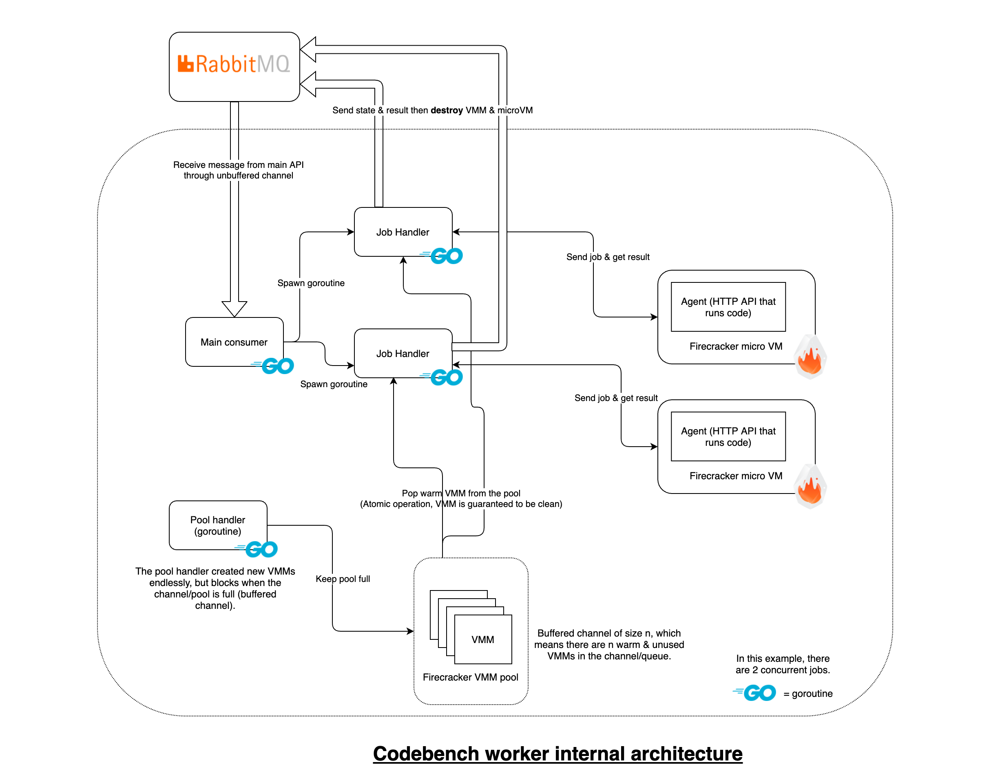

# CodeBench worker

The worker handles the lifecycle of an execution job.

- Get jobs from a RabbitMQ queue
- Keep a pool of microVMs warm, and send new jobs to pre-booted VM to reduce overhead
- Run code execution jobs through the [agent](https://github.com/codebench-esgi/agent)
- Update back an ephemeral RabbitMQ queue for each job with status and result

The worker uses [firecracker-go-sdk](https://github.com/firecracker-microvm/firecracker-go-sdk) to communicate with the microVMs.



## Requirements

- The `firecracker` binary in the `PATH`
- A rootfs in `../agent/rootfs.ext4` with the [agent](https://github.com/codebench-esgi/agent) installed and enabled at boot
- A Linux kernel at `../../linux/vmlinux`.
- CNI plugins and config (see below)

Both the rootfs and the kernel can be built with scripts in the linked repo.

### CNI

In `/etc/cni/conf.d/fcnet.conflist`:

```json
{
  "name": "fcnet",
  "cniVersion": "0.4.0",
  "plugins": [
    {
      "type": "ptp",
      "ipMasq": true,
      "ipam": {
        "type": "host-local",
        "subnet": "192.168.127.0/24",
        "resolvConf": "/etc/resolv.conf"
      }
    },
    {
      "type": "tc-redirect-tap"
    }
  ]
}
```

If you want to disable the internet access of the micro VM, you can set `ipMasq` to `false`. This will disable the IP masquerade on the host for this network.

You should also have the required CNI plugins binaries in `/opt/cni/bin`:

From: https://github.com/containernetworking/plugins

- host-local
- ptp

From: https://github.com/awslabs/tc-redirect-tap

- tc-redirect-tap

## Demo

Start RabbitMQ:

```sh
docker-compose up -d
```

Start the worker:

```
» go run
```

Let's add a job to compile and run this program:

```c
#include <stdio.h>

int main() {
   printf("Hello, World!");
   return 0;
}
```

We will send this job:

```json
{
  "id": "666",
  "type": "code",
  "code": "#include <stdio.h>\r\nint main() {\r\n   printf(\"Hello, World!\");\r\n   return 0;\r\n}"
}
```

This is the JSON request for RabbitMQ:

```json
{
  "routing_key": "jobs",
  "properties": {},
  "payload": "{\"id\":\"666\", \"type\": \"code\", \"code\":\"#include <stdio.h>\\r\\nint main() {\\r\\n   \\/\\/ printf() displays the string inside quotation\\r\\n   printf(\\\"Hello, World!\\\");\\r\\n   return 0;\\r\\n}\"}\r\n",
  "payload_encoding": "string"
}
```

Let's send it:

```sh
» curl 'http://localhost:15672/api/exchanges/%2F/amq.default/publish' -u admin:admin -d '@req.json'
{"routed":true}
```

The worker gets the job, gets a microVM from the pool, and handles the job:

```
INFO[0066]/root/codebench/worker/main.go:67 main.main() Received a message: {"id":"666", "type": "code", "code":"#include <stdio.h>\r\ni t main() {\r\n   \/\/ printf() displays the string inside quotation\r\n   printf(\"Hello, World!\");\r\n   return 0;\r\n}"}
INFO[0066]/root/codebench/worker/job.go:13 main.benchJob.run() Handling job                                  job="{666 code  #include <stdio.h>\r\nint main() {\r\n   // printf() displays the string inside quotation\r\n   printf(\"Hello, World!\");\r\n   return 0;\r\n}}"
INFO[0066]/root/codebench/worker/job_queue_rabbitmq.go:82 main.jobQueue.setjobStatus() Set job status                                status=received
INFO[0066]/root/codebench/worker/job_queue_rabbitmq.go:82 main.jobQueue.setjobStatus() Set job status                                status=running
INFO[0066]/root/codebench/worker/job.go:88 main.benchJob.run() Job execution finished                        result="{ Hello, World!}"
INFO[0066]/root/codebench/worker/job_queue_rabbitmq.go:125 main.jobQueue.setjobResult() Set job result                                jobStatus="&{666 done   Hello, World!}"
INFO[0066]/root/codebench/worker/vm.go:43 main.runningFirecracker.shutDown() stopping                                      ip=192.168.127.6
WARN[0066] firecracker exited: signal: terminated
```

At the same time, a new VM has been added to the missing spot in the pool.

Let's check RabbitMQ:

```
» docker-compose exec rabbitmq rabbitmqadmin -u admin -p admin list queues
+----------------+----------+
|      name      | messages |
+----------------+----------+
| job_status_666 | 3        |
| jobs           | 0        |
+----------------+----------+
```

We now have a queue corresponding to the ID of the job, with message in it:

```
» docker-compose exec rabbitmq rabbitmqadmin -u admin -p admin get queue=job_status_666 count=3 ackmode=ack_requeue_false
+----------------+----------+---------------+--------------------------------------------------------------------------------+---------------+------------------+-------------+
|  routing_key   | exchange | message_count |                                    payload                                     | payload_bytes | payload_encoding | redelivered |
+----------------+----------+---------------+--------------------------------------------------------------------------------+---------------+------------------+-------------+
| job_status_666 |          | 2             | {"id":"666","status":"received","stderr":"","stdout":""}          | 69            | string           | False       |
| job_status_666 |          | 1             | {"id":"666","status":"running","stderr":"","stdout":""}           | 68            | string           | False       |
| job_status_666 |          | 0             | {"id":"666","status":"done","stderr":"","stdout":"Hello, World!"} | 78            | string           | False       |
+----------------+----------+---------------+--------------------------------------------------------------------------------+---------------+------------------+-------------+
```

Our C program has been successfully compiled and executed!

```json
{
  "id": "666",
  "status": "done",
  "stderr": "",
  "stdout": "Hello, World!"
}
```

## Known issues

Cleanup when shutting down VMs does not work properly.
